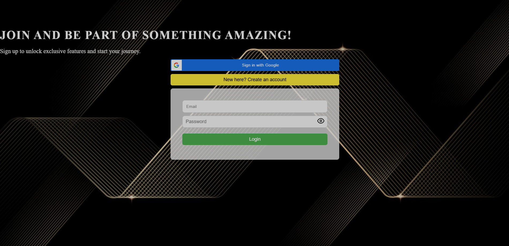

# Frontend User Registration and Authentication

This is the frontend for a full-stack application built with **React.js** for user registration, login, and profile management, connected to a backend for user authentication and data management.

## 🚀 Running Locally

Before running the application, make sure you have **Node.js** and **npm** installed.

### 1. Clone the repository:

Clone the repository to your local machine:

```bash
git clone https://github.com/shivasaineelam/finacplus-full-stack-shivasaineelam.git
```

### 2. Navigate to the frontend directory:

Change into the frontend directory:

```bash
cd frontend
```

### 3. Set up environment variables:

Create a `.env` file in the root of the frontend directory and add the following variables:

```env
VITE_USER_REGISTRATION_BACKEND=http://localhost:5000
VITE_GOOGLE_CLIENT_ID=81372339458-a5qqdu626b3ih3pfmo5v6ct1njku5hht.apps.googleusercontent.com
```

### 4. Install dependencies:

Run the following command to install the necessary dependencies:

```bash
npm install
```

### 5. Start the application:

Once the installation is complete, start the development server:

```bash
npm run dev
```

The app will be available at `http://localhost:5173`.

---

## 📜 Features

- **User Registration & Login:** Users can sign up or log in via email or Google OAuth.
- **Profile Management:** Users can update their personal details, including name, email, age, and password.
- **Password Validation:** Ensures that passwords meet security criteria (minimum length, number, symbol, etc.).

---

## ⚙️ Tech Stack

- **Frontend:** React.js, React Router
- **Authentication:** JWT, Google OAuth
- **State Management:** Redux
- **API Calls:** Axios for HTTP requests
- **CSS:** Custom styling for the UI

---

## 📝 Key Components

- **App.js:** Main application component that manages the login, registration, and profile forms.
- **GoogleAuth.js:** Handles Google OAuth login functionality.
- **UserForm.js:** Contains the registration and login forms, allowing users to switch between login and registration.
- **UserDialog.js:** Modal for users to complete their profile when logged in via Google OAuth.
- **ProfilePage.js:** Displays and allows users to update their profile information.
- **PasswordComponent.js:** A custom component for password input with visibility toggle and validation feedback.

---

## 📸 Screenshots

### User Registration Form
This is what the user registration page looks like, including the fields for name, email, age, and password.


### Profile Completion Modal
After logging in via Google, users are prompted to complete their profile with additional information.


### User Login Page
This is the login page, allowing users to log in with their email and password.



### User Profile Page
Once logged in, users can view and edit their profile information.


### Profile Information Overview
Here's an overview of the profile page showing user's details and options for editing or deleting the account.


---

